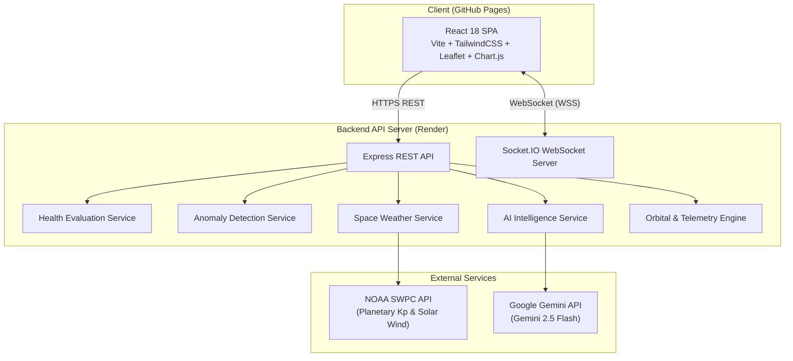

# 🛰️ SpaceGuard AI — Satellite Intelligence & Telemetry Platform

<div align="center">


[](https://react.dev/)
[](https://tailwindcss.com/)
[](https://nodejs.org/)
[](https://socket.io/)
[](https://ai.google.dev/)
[](https://www.swpc.noaa.gov/)
[](https://github.com/features/actions)

**An AI-powered situational awareness platform transforming raw satellite telemetry, orbital mechanics, and space-weather data into real-time, actionable mission intelligence.**

[Live Demo](https://siddharth1193.github.io/SpaceGuard-AI-Exploration/) • [Architecture](docs/ARCHITECTURE.md) • [API Documentation](docs/API.md) • [Deployment Guide](docs/DEPLOYMENT.md)

</div>

---

## 📖 Overview

Space operations produce massive streams of telemetry every second. Mission controllers and operations engineers often face data overload, slow anomaly detection, and difficult interpretation of geomagnetic storm risks.

**SpaceGuard AI** provides an end-to-end intelligence hub that:
- Aggregates and continuously monitors satellite telemetry across LEO, MEO, and GEO constellations.
- Computes comprehensive **5-factor health evaluations** and flags multi-parameter anomalies in real time.
- Combines live **NOAA Space Weather Prediction Center (SWPC)** data with orbital physics to evaluate geomagnetic storm risks.
- Employs **Google Gemini AI** to deliver instant anomaly diagnosis, root-cause analysis, and natural-language mission insights.

---

## ✨ Key Features

| Feature | Description |
|---|---|
| 🛰️ **Fleet Monitoring** | Real-time tracking of 12 satellites across diverse orbital regimes (LEO, MEO, GEO) with live telemetry streams. |
| ⚡ **5-Factor Health Engine** | Multi-dimensional scoring evaluating data age, orbital altitude, orbital velocity, space weather risk, and telemetry completeness. |
| ⚠️ **5-Rule Anomaly Detection** | Rule-based and statistical anomaly engine classifying severity (`NOMINAL`, `WARNING`, `CRITICAL`) across battery, temperature, radiation, and altitude decay. |
| 🌌 **NOAA Live Space Weather** | Real-time planetary Kp index, solar wind speed, magnetic field readings, and geomagnetic storm categorization with automated failover. |
| 🤖 **Google Gemini AI Analyst** | Context-grounded conversational AI assistant and automated telemetry risk analysis using `@google/genai` (with offline deterministic fallback). |
| 🗺️ **Interactive Satellite Map** | Geographic ground tracks, sub-satellite coordinates, and live health-coded markers powered by Leaflet. |
| 📊 **Fleet Analytics Dashboard** | Fleet distribution charts, altitude vs. velocity correlations, and status breakdowns powered by Chart.js. |
| 📡 **Real-Time WebSocket Sync** | Bi-directional synchronization via Socket.IO pushing telemetry updates every 30 seconds. |

---

## 🏗️ System Architecture



---

## 🛠️ Tech Stack

### Frontend
- **Framework**: [React 18](https://react.dev/) + [Vite](https://vitejs.dev/)
- **Routing**: [React Router v6](https://reactrouter.com/) (with GitHub Pages SPA redirect support)
- **Styling**: [Tailwind CSS v3](https://tailwindcss.com/)
- **Visualizations & Maps**: [Leaflet](https://leafletjs.com/) + [React Leaflet](https://react-leaflet.js.org/), [Chart.js](https://www.chartjs.org/) + [React-Chartjs-2](https://react-chartjs-2.js.org/)
- **Real-Time & Networking**: [Socket.IO Client](https://socket.io/), [Axios](https://axios-http.com/)
- **Testing**: [Vitest](https://vitest.dev/) + [Testing Library](https://testing-library.com/)

### Backend
- **Runtime**: [Node.js](https://nodejs.org/) (ES Modules)
- **Framework**: [Express.js](https://expressjs.com/)
- **Real-Time**: [Socket.IO](https://socket.io/)
- **AI Integration**: Official [`@google/genai`](https://www.npmjs.com/package/@google/genai) SDK (Google Gemini)
- **Orbital Calculations**: `satellite.js`
- **Testing**: [Jest](https://jestjs.io/)

---

## 🚀 Quick Start

### Prerequisites
- **Node.js**: v18.0.0 or higher
- **npm** or **pnpm**

### 1. Clone the Repository
```bash
git clone https://github.com/siddharth1193/SpaceGuard-AI-Exploration.git
cd SpaceGuard-AI-Exploration
```

### 2. Backend Setup
```bash
cd backend
npm install

# Copy environment template
cp .env.example .env
```

*(Optional)* Configure `backend/.env`:
```env
PORT=3001
CORS_ORIGIN=http://localhost:3000
GEMINI_API_KEY=your-gemini-api-key-here
GEMINI_MODEL=gemini-2.5-flash
```
> **Note**: The backend functions completely in local demo mode with deterministic fallback algorithms even if no `GEMINI_API_KEY` is provided!

Start the backend server:
```bash
npm run dev
# Server running at http://localhost:3001
```

### 3. Frontend Setup
In a new terminal:
```bash
cd frontend
npm install

# Copy environment template (optional for local dev)
cp .env.example .env
```

Start the Vite development server:
```bash
npm run dev
# Frontend running at http://localhost:3000
```

---

## 🧪 Testing

### Frontend Unit Tests
```bash
cd frontend
npm run test
```

### Backend Unit Tests
```bash
cd backend
npm test
```

---

## ⚙️ Environment Variables

### Backend (`backend/.env`)
| Variable | Description | Default | Required |
|---|---|---|---|
| `PORT` | HTTP port for the Express server | `3001` | No |
| `CORS_ORIGIN` | Allowed origin for frontend requests | `http://localhost:3000` | No |
| `GEMINI_API_KEY` | Google Gemini API key for AI assistant features | `None` (Deterministic Fallback) | Optional |
| `GEMINI_MODEL` | Gemini model identifier | `gemini-2.5-flash` | No |

### Frontend (`frontend/.env`)
| Variable | Description | Default | Required |
|---|---|---|---|
| `VITE_API_URL` | Backend REST API base URL | `/` (uses Vite proxy in dev) | For Prod |
| `VITE_SOCKET_URL` | Backend WebSocket base URL | `/` (uses Vite proxy in dev) | For Prod |

---

## 🚢 Deployment

Detailed deployment instructions are available in [docs/DEPLOYMENT.md](docs/DEPLOYMENT.md).

- **Frontend**: Automatically deployed to **GitHub Pages** via GitHub Actions workflow [`.github/workflows/deploy-frontend.yml`](.github/workflows/deploy-frontend.yml) upon pushes to `main`.
- **Backend**: Deployed to **Render** as a Node.js web service.

---

## 📁 Repository Structure

```text
SpaceGuard-AI-Exploration/
├── .github/
│   └── workflows/
│       └── deploy-frontend.yml     # GitHub Actions workflow for Pages deployment
├── docs/                           # Project specifications & technical documentation
│   ├── API.md                      # REST & WebSocket API specification
│   ├── ARCHITECTURE.md             # System architecture & data flow diagrams
│   ├── CHANGELOG.md                # Version history & release notes
│   ├── DATA-MODEL.md               # Telemetry, Satellite & Anomaly schemas
│   ├── DEPLOYMENT.md               # Production deployment guide
│   ├── DESIGN.md                   # UI design tokens & UX guidelines
│   ├── PRD.md                      # Product requirements document
│   └── TROUBLESHOOTING.md          # Diagnostic & resolution runbook
├── frontend/                       # React 18 Single Page Application
│   ├── src/
│   │   ├── components/             # UI Components (Cards, Gauges, Tables, Map)
│   │   ├── hooks/                  # Custom React hooks (telemetry, sockets)
│   │   ├── pages/                  # 8 Core Views (Overview, Satellites, AI Assistant, etc.)
│   │   └── utils/                  # Color utilities & calculation helpers
│   ├── index.html
│   ├── package.json
│   └── vite.config.js
├── backend/                        # Node.js Express & Socket.IO server
│   ├── src/
│   │   ├── controllers/            # Request handlers
│   │   ├── routes/                 # Express API routes
│   │   ├── services/               # Gemini AI, Health, Anomaly, Space Weather services
│   │   └── server.js               # Application entry point
│   └── package.json
└── README.md                       # Project root README
```

---

## 📄 License

This project is licensed under the [MIT License](LICENSE).
