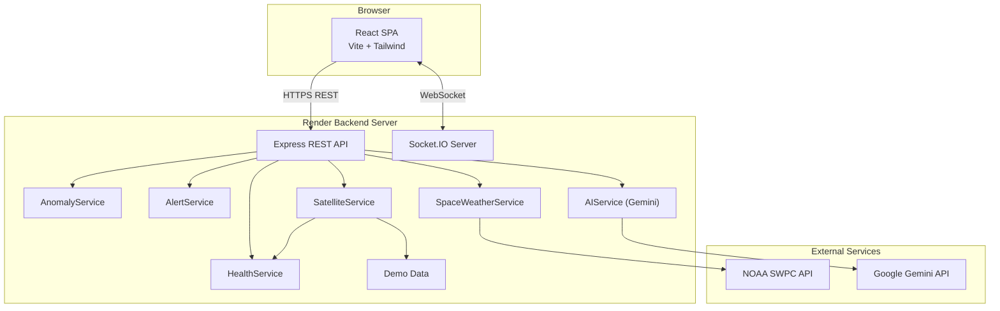
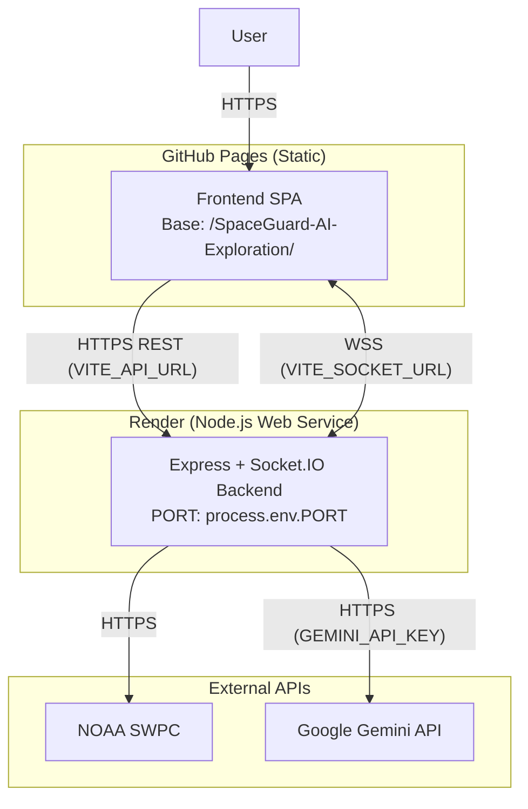

# SpaceGuard AI — Architecture

## System Context

SpaceGuard AI is a two-tier web application:

1. **Frontend** — React SPA deployed to **GitHub Pages**
2. **Backend** — Node.js/Express API server deployed to **Render**

The frontend communicates with the backend via REST API and WebSocket (Socket.IO).
The backend connects to Google Gemini API for AI features.

## AI Architecture (Google Gemini)

- **Flow**: `React Frontend → SpaceGuard Backend (Node.js) → Google Gemini API`
- **Security**: `GEMINI_API_KEY` is kept strictly server-side in Node.js backend environment variables (`.env`). It is NEVER exposed to the client bundle or `VITE_` variables.
- **Provider**: Official `@google/genai` JavaScript SDK.
- **Models**: Configurable via `GEMINI_MODEL` (default: `gemini-2.5-flash`).
- **Resilience**: Timeout handling (15s), sanitized log masking for API keys, rate-limit & error handling, fallback to local deterministic telemetry analysis if `GEMINI_API_KEY` is missing or un-contactable.

## Deployment Architecture

